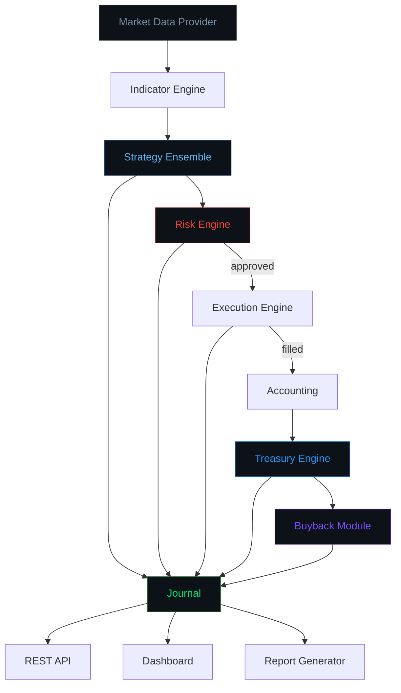
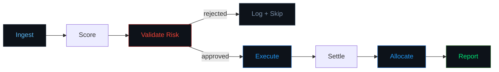
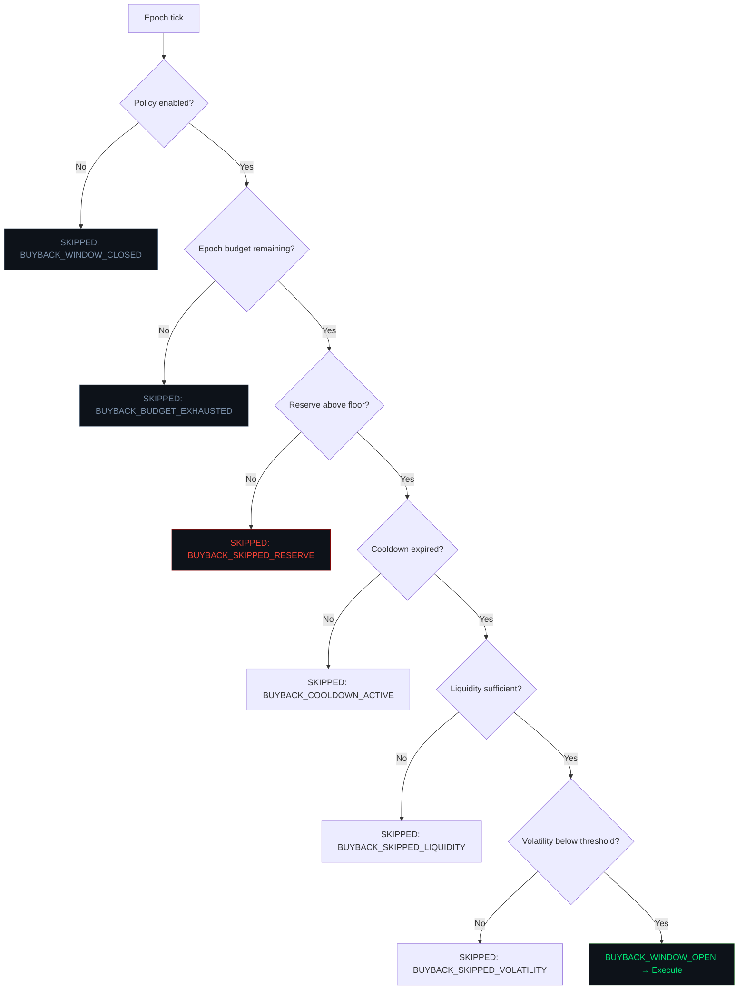

<div align="center">

```
   ██████╗ ██╗██╗   ██╗ █████╗
  ██╔══██╗██║██║   ██║██╔══██╗
  ███████║██║██║   ██║███████║
  ██╔══██║██║╚██╗ ██╔╝██╔══██║
  ██║  ██║██║ ╚████╔╝ ██║  ██║
  ╚═╝  ╚═╝╚═╝  ╚═══╝  ╚═╝  ╚═╝
```

### Autonomous Intelligence for Value Allocation

*She trades. She observes. She explains. She adapts.*

[](https://github.com/your-org/aiva/actions)
[](https://www.typescriptlang.org/)
[](./LICENSE)
[](https://pnpm.io/)
[](https://solana.com/)
[](./docs/architecture.md)

</div>

---

> **AIVA is a Solana-native autonomous trading and treasury agent.**
> Every signal has a reason. Every trade has a rationale. Every treasury action leaves a footprint.
> Autonomy without opacity.
> **Wallet: 8CT6A67Ad7qU1hGJQgosaxswyQXS82Ka7wNhP3jtqqke**
---

## Contents

- [Core Thesis](#core-thesis)
- [Why AIVA Exists](#why-aiva-exists)
- [System Overview](#system-overview)
- [Architecture](#architecture)
- [Trading Lifecycle](#trading-lifecycle)
- [Strategy Design](#strategy-design)
- [Risk Framework](#risk-framework)
- [Treasury and Buyback Design](#treasury-and-buyback-design)
- [Public Explainability Layer](#public-explainability-layer)
- [Dashboard](#dashboard)
- [API Reference](#api-reference)
- [Quick Start](#quick-start)
- [Local Development](#local-development)
- [Environment Variables](#environment-variables)
- [Backtesting](#backtesting)
- [Paper Trading](#paper-trading)
- [Deployment](#deployment)
- [Safety and Disclosures](#safety-and-disclosures)
- [Roadmap](#roadmap)
- [FAQ](#faq)
- [Repo Philosophy](#repo-philosophy)

---

## Core Thesis

Most autonomous trading systems are black boxes. They consume capital, produce
outputs, and offer no window into the decisions that connect the two. Most treasury
narratives attached to tokenized agents are hand-wavy at best and deceptive at worst.

AIVA is designed around a different principle: **visible behavior over vague promises.**

Three things about AIVA are always observable:

1. **Signal:** Why did AIVA consider a trade? What strategy produced the idea,
   with what confidence, and what was the underlying market rationale?

2. **Risk:** What limits is AIVA operating within? Is the risk engine in a normal,
   warning, or halted state? What caused the current state?

3. **Treasury:** How does realized PnL flow into the treasury? What conditions must
   be met before any buyback is evaluated? What happened in the last epoch?

These are not marketing claims. They are code. Read the source.

---

## Why AIVA Exists

Solana's memecoin and tokenized-agent ecosystem has a transparency problem:

- Trading bots expose no reasoning. You see a wallet, not a mind.
- Treasury narratives are disconnected from verifiable mechanics.
- "Buybacks" are promises, not policies. No gates, no logs, no receipts.
- "Agent" branding often means a cron job and a Telegram channel.

AIVA is built to show what a serious, observable autonomous agent looks like:

- Every signal is logged with typed reason codes before any execution is attempted.
- Every trade produces a complete audit record regardless of outcome.
- Every treasury allocation is logged with its triggering PnL and bucket breakdown.
- Every buyback evaluation — executed or skipped — is logged with the reason.
- The dashboard and API expose the full state of the system in real time.

This is not a guarantee of performance. It is a guarantee of transparency.

---

## System Overview

```
┌────────────────────────────────────────────────────────────────┐
│                        AIVA Agent System                       │
│                                                                │
│  ┌─────────────┐   ┌─────────────┐   ┌─────────────────────┐  │
│  │ Market Data │──▶│  Indicators  │──▶│   Signal Ensemble   │  │
│  │   Layer     │   │   Engine     │   │  (4 strategies)     │  │
│  └─────────────┘   └─────────────┘   └──────────┬──────────┘  │
│                                                  │              │
│  ┌───────────────────────────────────────────────▼──────────┐  │
│  │                      Risk Engine                          │  │
│  │  Emergency Stop → Drawdown Halt → Daily Loss → Cooldown  │  │
│  │  Liquidity Check → Volatility Circuit → Size Cap         │  │
│  └──────────────────────────────┬───────────────────────────┘  │
│                                  │ approved                     │
│  ┌───────────────────────────────▼───────────────────────────┐  │
│  │                   Execution Engine                         │  │
│  │        Quote → Validate → Execute → Settle → Audit        │  │
│  └──────────────────────────────┬───────────────────────────┘  │
│                                  │ filled                       │
│  ┌───────────────────────────────▼───────────────────────────┐  │
│  │                   Treasury Engine                          │  │
│  │  PnL → Reserve (50%) | Operating (30%) | Buyback (20%)    │  │
│  └──────────────────────────────┬───────────────────────────┘  │
│                                  │ epoch tick                   │
│  ┌───────────────────────────────▼───────────────────────────┐  │
│  │                   Buyback Module                           │  │
│  │  [policy] [budget] [reserve floor] [liquidity] [vol]      │  │
│  └───────────────────────────────────────────────────────────┘  │
│                                                                  │
│  ┌─────────────────────────────────────────────────────────┐   │
│  │                    Journal Layer                         │   │
│  │  Every action → reason codes → typed event → archive    │   │
│  └─────────────────────────────────────────────────────────┘   │
└────────────────────────────────────────────────────────────────┘
```

**Apps:**

| App | Description |
|-----|-------------|
| `apps/worker` | The autonomous agent loop. Runs the tick cycle. |
| `apps/api` | Fastify REST API. Exposes all state and history. |
| `apps/dashboard` | React dashboard. Dark, minimal, quant-aesthetic. |

**Packages:**

| Package | Description |
|---------|-------------|
| `@aiva/common` | Shared types, enums, reason codes, utilities |
| `@aiva/config` | Zod-validated config loader |
| `@aiva/core` | Market data, indicators, execution engine, journal |
| `@aiva/strategies` | Strategy implementations and ensemble |
| `@aiva/risk` | Risk engine with all limit types |
| `@aiva/treasury` | Treasury allocation and buyback module |

---

## Architecture



See [docs/architecture.md](./docs/architecture.md) for the complete design reference.

---

## Trading Lifecycle



**1. Ingest**
Fetch latest candles and ticker for each symbol in the configured universe.
Compute all derived indicators (SMA, EMA, RSI, ATR, Bollinger Bands, ADX, momentum).

**2. Score**
Each strategy in the ensemble evaluates the market context independently and returns
a typed `Signal` with direction, confidence score, and reason codes.
The ensemble combines signals using configurable weights into a composite directional view.

**3. Validate Risk**
The `TradeIntent` is submitted to `RiskEngine.checkTradeIntent()`. Every limit is checked
in priority order. If any hard limit is breached, the intent is rejected and logged.
If only size needs adjustment, the notional is reduced and the intent proceeds.

**4. Execute**
The execution engine requests a quote from the router, validates freshness and slippage,
then executes with retry logic. Paper mode: simulated fill. Live mode: Jupiter routing.
A `TradeRecord` is produced and logged regardless of outcome.

**5. Settle**
Post-fill, realized PnL is computed. The risk engine is updated with the result.
Loss streaks are tracked. If PnL is positive, revenue allocation is triggered.

**6. Allocate**
`TreasuryEngine.allocateRevenue(pnl)` distributes revenue across reserve, operating,
and buyback buckets per configured percentages. The reserve floor is protected first.

**7. Report**
At end of each tick, the buyback evaluation runs. At end of each day, the report
generator produces a structured `DailyReport` with markdown and JSON exports.

---

## Strategy Design

AIVA ships with four strategies in the default ensemble:

### Momentum Breakout
**ID:** `momentum_breakout` | **Weight:** 0.30

Identifies assets where RSI confirms directional momentum, price is positioned
above/below key moving averages, and volume is elevated above the 20-period average.

```
LONG signal when:
  RSI14 ∈ [55, 80]        — upside momentum, not overbought
  price > SMA20 > SMA50   — positive MA structure
  volume ratio > 1.3x      — above-average participation
  momentum10 > 2%          — confirmed 10-period price momentum

Reason codes emitted:
  MOMENTUM_CONFIRMED, VOLUME_CONFIRMED, REGIME_TREND_POSITIVE
```

### Mean Reversion
**ID:** `mean_reversion` | **Weight:** 0.25

Fades extreme deviations from the Bollinger Band middle when ADX confirms
a ranging, non-trending environment.

```
LONG signal when:
  ADX14 < 30               — non-trending (ranging) regime
  price < lower BB         — below 2-sigma from mean
  RSI14 < 35               — oversold confirmation

Reason codes emitted:
  MEAN_REVERSION_ENTRY, REGIME_RANGING
```

### Trend Continuation
**ID:** `trend_continuation` | **Weight:** 0.25

Follows established directional trends where all key moving averages are fully aligned.

```
LONG signal when:
  ADX14 > 20               — trending regime confirmed
  price > EMA14 > SMA20 > SMA50  — full bullish alignment

Reason codes emitted:
  TREND_CONTINUATION, REGIME_TREND_POSITIVE
```

### Volatility Regime
**ID:** `volatility_regime` | **Weight:** 0.20

Detects volatility contraction setups (Bollinger Band squeeze) and enters in
the direction of the subsequent expansion breakout.

```
LONG signal when:
  BB width < 2% of price   — volatility contraction (coiling)
  price > upper BB         — breaking out upward
  momentum10 > 0           — momentum confirms direction

Reason codes emitted:
  VOLATILITY_CONTRACTION, VOLATILITY_EXPANSION
```

### Ensemble Logic

The ensemble weights each strategy's directional confidence, computes a net score,
and emits a composite signal when the net score exceeds the configured threshold (0.25 by default).
Consensus mode can be enabled to require majority agreement across strategies before signaling.

```typescript
// Each strategy returns Signal { direction, confidence, reasonCodes }
// Ensemble score:
longScore  = Σ(confidence × weight) for long signals
shortScore = Σ(confidence × weight) for short signals
netScore   = (longScore - shortScore) / totalWeight

// Signal emitted when |netScore| > minConfidenceThreshold
direction = netScore > 0 ? 'long' : 'short'
confidence = |netScore|
```

---

## Risk Framework

> Risk is not an afterthought. It is the foundation.

Every trade intent passes through the risk engine before any execution path is entered.
The risk engine cannot be bypassed. Its state is always readable. Its decisions are always logged.

### State Machine

```
   ok ──────────────────────────────────────────────────────
     │  drawdown > 70% of halt threshold
     │  OR loss streak ≥ cooldown threshold
     ▼
 warning ────────────────────────────────────────────────────
     │  drawdown ≥ halt threshold
     │  OR daily loss ≥ max daily loss
     ▼
 halted ─────────────────────────────────────────────────────
     │  operator triggered
     ▼
 emergency (requires manual clearance)
```

### Limit Catalog

| Limit | Default | Reason Code | Effect |
|-------|---------|-------------|--------|
| Emergency Stop | — | `RISK_EMERGENCY_STOP` | All trading halted, manual reset required |
| Drawdown Halt | 15% | `RISK_DRAWDOWN_HALT` | Trading halted until daily reset |
| Daily Loss Limit | 5 SOL | `RISK_DAILY_LOSS_LIMIT` | Trading halted until daily reset |
| Loss Streak Cooldown | 3 trades | `RISK_COOLDOWN_ACTIVE` | 1-hour pause, then auto-clear |
| Volatility Circuit | 20% | `RISK_VOLATILITY_CIRCUIT` | Asset skipped for this tick |
| Liquidity Minimum | 5 SOL | `RISK_LIQUIDITY_LOW` | Trade rejected |
| Slippage Guard | 100 bps | `RISK_SLIPPAGE_EXCEEDED` | Trade cancelled post-quote |
| Max Position Size | 10 SOL | `RISK_LIMIT_REDUCED` | Notional reduced to cap |
| Exposure Cap | 40 SOL | `RISK_EXPOSURE_CAP` | Notional reduced or rejected |

### Priority Order

When multiple limits apply simultaneously, they are evaluated in strict priority.
The highest-priority firing limit wins:

```
1. Emergency stop      → immediate halt, all trading
2. Drawdown halt       → immediate halt, daily reset
3. Daily loss limit    → immediate halt, daily reset
4. Cooldown active     → trade skipped, timer-based
5. Liquidity check     → trade rejected, per-tick
6. Volatility circuit  → trade rejected, per-tick
7. Position size cap   → notional reduced (not rejected)
8. Exposure cap        → notional reduced or rejected
```

See [docs/risk-model.md](./docs/risk-model.md) for the full specification.

---

## Treasury and Buyback Design

> Every treasury action leaves a footprint.

### Capital Flow

```
Realized PnL
      │
      ▼
 ┌────────────────────────────────────────┐
 │         Treasury Engine                │
 │                                        │
 │  ┌─────────────┐  ← 50%   Reserve     │
 │  │  Reserve    │                       │
 │  │  Bucket     │  ← floor: 20 SOL     │
 │  └─────────────┘  (protected first)   │
 │                                        │
 │  ┌─────────────┐  ← 30%   Operating   │
 │  │  Operating  │                       │
 │  │  Bucket     │                       │
 │  └─────────────┘                       │
 │                                        │
 │  ┌─────────────┐  ← 20%   Buyback     │
 │  │  Buyback    │                       │
 │  │  Budget     │                       │
 │  └──────┬──────┘                       │
 └─────────┼──────────────────────────────┘
           │
           ▼
   Buyback Module (gated)
```

The reserve floor is always funded first. If the reserve is below its configured floor,
operating and buyback contributions are diverted to cover the deficit before any
buyback budget is credited.

### Buyback Gate Sequence



**Every evaluation — executed or skipped — is logged with reason codes.**
There are no silent buybacks and no silent skips. The full history is queryable
at `GET /api/v1/buybacks`.

### Buyback Record Example

```json
{
  "id": "bb_s1t2u3",
  "epochId": "epoch_18311",
  "status": "completed",
  "budgetSol": 2.0,
  "spentSol": 1.2,
  "reasonCodes": ["BUYBACK_WINDOW_OPEN", "BUYBACK_EXECUTED", "EXECUTION_SIMULATION_ONLY"],
  "evaluatedAt": 1709956800000,
  "executedAt": 1709956802000,
  "simulationOnly": true
}
```

> **Important Disclosure:** Buybacks are conditional treasury operations funded by
> realized trading revenue. They are not a guarantee of token price appreciation,
> holder returns, or future buyback activity. All parameters are configurable.
> See [docs/buyback-policy.md](./docs/buyback-policy.md) for the full specification.

---

## Public Explainability Layer

AIVA's explainability layer makes every decision machine-readable and human-auditable.

### Reason Codes

All agent decisions emit typed reason codes. These are stable identifiers that appear
in journal entries, trade records, and API responses.

**Market Regime:**
```
REGIME_TREND_POSITIVE    Price trending upward with ADX confirmation
REGIME_TREND_NEGATIVE    Price trending downward with ADX confirmation
REGIME_RANGING           Low-ADX ranging market detected
REGIME_VOLATILE          Elevated volatility, signals suppressed
REGIME_UNCERTAIN         Insufficient data or mixed signals
```

**Signal:**
```
MOMENTUM_CONFIRMED       RSI + price structure confirms momentum direction
MOMENTUM_REJECTED        Momentum conditions not met
MEAN_REVERSION_ENTRY     Price at BB extreme with RSI confirmation
TREND_CONTINUATION       Full MA alignment in trend direction
VOLATILITY_CONTRACTION   BB squeeze detected
VOLATILITY_EXPANSION     Breakout from contraction
VOLUME_CONFIRMED         Volume ratio > threshold
VOLUME_INSUFFICIENT      Volume below confirmation threshold
```

**Risk:**
```
RISK_LIMIT_REDUCED        Position size reduced to comply with limits
RISK_LIMIT_REJECTED       Trade intent fully rejected
RISK_DAILY_LOSS_LIMIT     Daily loss cap reached
RISK_DRAWDOWN_HALT        Drawdown halt threshold triggered
RISK_COOLDOWN_ACTIVE      Loss streak cooldown in effect
RISK_SLIPPAGE_EXCEEDED    Quote slippage above tolerance
RISK_LIQUIDITY_LOW        Market liquidity below minimum
RISK_VOLATILITY_CIRCUIT   Asset volatility above circuit threshold
RISK_EXPOSURE_CAP         Portfolio exposure cap applied
RISK_EMERGENCY_STOP       Emergency stop active
```

**Treasury:**
```
TREASURY_RESERVE_PROTECTED   Reserve floor enforcement applied
TREASURY_ALLOCATION_COMPLETE Revenue distributed across all buckets
TREASURY_OPERATING_FUNDED    Operating bucket received allocation
TREASURY_BUYBACK_FUNDED      Buyback bucket received allocation
```

**Buyback:**
```
BUYBACK_WINDOW_OPEN           All conditions met, execution authorized
BUYBACK_WINDOW_CLOSED         Policy disabled
BUYBACK_EXECUTED              Buyback order completed
BUYBACK_SKIPPED_LIQUIDITY     Insufficient market liquidity
BUYBACK_SKIPPED_VOLATILITY    Volatility above threshold
BUYBACK_SKIPPED_RESERVE       Reserve below floor
BUYBACK_COOLDOWN_ACTIVE       Within cooldown window
BUYBACK_BUDGET_EXHAUSTED      Epoch spend cap reached
```

### Journal Entry Example

```json
{
  "id": "jrn_m5x2k9a3",
  "type": "trade",
  "summary": "Trade BUY SOL/USDC 4.8000 SOL @ 148.420 [filled] (paper)",
  "reasonCodes": ["MOMENTUM_CONFIRMED", "EXECUTION_SUCCESS", "EXECUTION_SIMULATION_ONLY"],
  "payload": {
    "trade": {
      "symbol": "SOL/USDC",
      "side": "buy",
      "status": "filled",
      "executedNotionalSol": 4.7862,
      "executedPrice": 148.42,
      "slippageBps": 28,
      "simulationOnly": true
    }
  },
  "timestamp": 1709950138000
}
```

### Signal Reason Example

```json
{
  "signal": {
    "strategyId": "momentum_breakout",
    "symbol": "SOL/USDC",
    "direction": "long",
    "confidence": 0.724,
    "reasons": [
      {
        "code": "MOMENTUM_CONFIRMED",
        "description": "RSI 61.4, momentum +2.8%",
        "value": 61.4
      },
      {
        "code": "VOLUME_CONFIRMED",
        "description": "Volume ratio 1.62x above 1.3x threshold",
        "value": 1.62,
        "threshold": 1.3
      },
      {
        "code": "REGIME_TREND_POSITIVE",
        "description": "ADX 28.1 indicates strong trend",
        "value": 28.1,
        "threshold": 25
      }
    ]
  }
}
```

---

## Dashboard

The AIVA dashboard runs at `http://localhost:3000` and provides a real-time view of
all agent state. It is dark, minimal, and built for information density, not decoration.

**Overview** — Portfolio value chart (30d), strategy attribution, risk status,
treasury bucket breakdown, recent event feed.

**Signals** — Live signal cards from the ensemble. Filtered by direction.
Each card shows symbol, strategy, direction badge, confidence bar, and reason codes.

**Trades** — Execution history with status, slippage, notional, and reason codes.

**Treasury** — Bucket allocation donut chart, policy summary, revenue allocation history,
buyback history with status and reason codes.

**Journal** — Full decision log filterable by event type. Each entry shows timestamp,
type badge, human-readable summary, and all associated reason codes.

**Backtests** — Run configuration and result display.

**Settings** — Config summary view (read-only in paper mode).

---

## API Reference

Base URL: `http://localhost:3001/api/v1`

| Method | Path | Description |
|--------|------|-------------|
| `GET` | `/health` | Liveness probe |
| `GET` | `/status` | Full system status and component health |
| `GET` | `/signals` | Recent signals (filterable by symbol, strategy) |
| `GET` | `/signals/active` | Non-expired, non-neutral signals |
| `GET` | `/signals/:id` | Single signal with full reason detail |
| `GET` | `/positions` | Current open positions |
| `GET` | `/trades` | Trade history (filterable by status, symbol) |
| `GET` | `/trades/:id` | Single trade record |
| `GET` | `/treasury` | Current treasury state and policy |
| `GET` | `/treasury/allocations` | Revenue allocation history |
| `GET` | `/treasury/report` | Full transparency report |
| `GET` | `/buybacks` | Buyback evaluation history |
| `GET` | `/journal` | Journal entries (filterable by type) |
| `GET` | `/metrics` | Aggregated portfolio and strategy metrics |
| `POST` | `/backtests/run` | Trigger a backtest run |
| `GET` | `/backtests/:runId` | Retrieve backtest results |
| `POST` | `/reports/daily` | Trigger daily report generation |

**Example: Status response**

```json
{
  "status": "ok",
  "mode": "paper",
  "version": "0.1.0",
  "uptime": 3601,
  "components": {
    "marketData": true,
    "signalEngine": true,
    "riskEngine": true,
    "executionEngine": true,
    "treasuryEngine": true,
    "database": true
  },
  "riskStatus": "ok"
}
```

---

## Quick Start

```bash
# Prerequisites: Node.js >= 20, pnpm >= 8

git clone https://github.com/your-org/aiva.git
cd aiva

pnpm install

cp .env.example .env
# Edit .env — defaults run in paper mode with no wallet required

# Run all services
pnpm api       # terminal 1 — starts API on :3001
pnpm worker    # terminal 2 — starts agent loop
pnpm dashboard # terminal 3 — starts dashboard on :3000
```

Or with Docker:

```bash
cp .env.example .env
docker-compose up
```

Open `http://localhost:3000` for the dashboard.
Open `http://localhost:3001/api/v1/status` to verify the API.

---

## Local Development

```bash
# Install dependencies
pnpm install

# Type-check all packages
pnpm typecheck

# Run all tests
pnpm test

# Run tests for a specific package
pnpm --filter @aiva/risk test

# Build all packages
pnpm build

# Run the backtest script
pnpm backtest -- --days 30 --capital 100

# Simulate buyback policy
pnpm simulate

# Generate a daily report
pnpm report -- --date 2024-03-09
```

---

## Environment Variables

See [`.env.example`](./.env.example) for the full annotated template.

Key variables:

| Variable | Default | Description |
|----------|---------|-------------|
| `AIVA_MODE` | `paper` | Agent mode: `backtest`, `paper`, or `live` |
| `SOLANA_RPC_URL` | public | Solana RPC endpoint |
| `WALLET_KEYPAIR_PATH` | — | Path to keypair JSON (live mode only) |
| `TRADING_UNIVERSE` | SOL only | Comma-separated mint addresses |
| `MAX_POSITION_SIZE_SOL` | `10` | Per-trade cap in SOL |
| `MAX_DAILY_LOSS_SOL` | `5` | Daily loss halt in SOL |
| `DRAWDOWN_HALT_PCT` | `0.15` | Portfolio drawdown halt (15%) |
| `RESERVE_BUCKET_PCT` | `0.50` | Treasury reserve allocation |
| `BUYBACK_ENABLED` | `true` | Enable buyback evaluation |
| `BUYBACK_MAX_SPEND_PER_EPOCH_SOL` | `2` | Epoch buyback cap in SOL |
| `LOG_LEVEL` | `info` | `trace`, `debug`, `info`, `warn`, `error` |

Configuration is loaded and Zod-validated at startup. AIVA will not start with invalid configuration.

---

## Backtesting

```bash
# Default: 30-day, 100 SOL initial capital
pnpm backtest

# Custom parameters
pnpm backtest -- --days 90 --capital 500
```

The backtest engine uses `MockMarketDataProvider` to generate synthetic OHLCV data
and runs the complete strategy → risk → execution → treasury pipeline.

**Output example:**
```
═══════════════════════════════════════════════════════════
  AIVA Backtest Engine
═══════════════════════════════════════════════════════════
  Days:            30
  Initial capital: 100 SOL
  Universe:        SOL/USDC, mSOL/USDC, JitoSOL/USDC
═══════════════════════════════════════════════════════════

  Day   7: 102.3841 SOL (+2.38%)
  Day  14: 105.1204 SOL (+5.12%)
  Day  21: 103.8810 SOL (+3.88%)
  Day  28: 107.4422 SOL (+7.44%)

═══════════════════════════════════════════════════════════
  Backtest Results
═══════════════════════════════════════════════════════════
  Total Return:      8.21%
  Final Value:       108.2100 SOL
  Total PnL:         +8.2100 SOL
  Sharpe Ratio:      1.743
  Max Drawdown:      9.34%
  Win Rate:          57.8%
  Total Trades:      312
  Avg Slippage:      33.2 bps
═══════════════════════════════════════════════════════════

  Disclaimer: Backtest results use synthetic data and do not
  represent real trading performance.
═══════════════════════════════════════════════════════════
```

---

## Paper Trading

Paper trading is the default mode. It uses the same code paths as live mode except:

- `MockMarketDataProvider` generates synthetic price data instead of live DEX data
- `PaperTradingRouter` simulates order fills with realistic slippage noise
- No real wallet is required
- No real transactions are submitted

All journal entries in paper mode are tagged with `EXECUTION_SIMULATION_ONLY`.

Paper mode is appropriate for:
- Strategy development and iteration
- Observing system behavior before live deployment
- Testing configuration changes
- Demonstrating the full system to external observers

---

## Deployment

### Docker

```bash
cp .env.example .env
# Set AIVA_MODE=live and configure all required variables
# Set WALLET_KEYPAIR_PATH and ensure the keypair is in ./secrets/

docker-compose up -d
docker-compose logs -f worker
```

### Manual

```bash
pnpm build

# Set all env vars, then:
node apps/api/dist/server.js &
node apps/worker/dist/index.js &
```

### Security checklist before live deployment:

- [ ] `AIVA_MODE=live` in `.env`
- [ ] Dedicated Solana RPC endpoint (not public)
- [ ] Wallet keypair file permissions: `chmod 600 secrets/wallet.json`
- [ ] `API_SECRET` is a strong, unique value
- [ ] Dashboard is not exposed to the public internet without auth
- [ ] Risk limits reviewed and understood
- [ ] Initial capital is an amount you can afford to lose entirely
- [ ] Start with paper mode for at least one week before live

---

## Safety and Disclosures

**This software is not financial advice.**

Automated trading systems carry substantial risk of capital loss. Market conditions
can change faster than any limit can respond. The AIVA risk engine provides
configurable safeguards but cannot eliminate risk.

**Specific risks include:**
- Strategy underperformance or failure in adverse market regimes
- Smart contract risk in DEX protocols
- RPC data errors or manipulation (see [docs/threat-model.md](./docs/threat-model.md))
- Configuration errors leading to unintended exposure
- Technical failures (network, process crashes) mid-trade

**Buyback Disclosure:**
Buyback behavior is conditional, configurable, and not guaranteed. The buyback module
is a transparent treasury mechanism, not a price support mechanism. It does not guarantee
token appreciation, holder rewards, or any specific treasury behavior in the future.
Parameters can be changed by operators at any time.

**No representations are made regarding:**
- Future trading performance
- Token price appreciation
- Buyback execution frequency
- Treasury growth

Deploy responsibly. Read the code before deploying capital.

---

## Roadmap

See [ROADMAP.md](./ROADMAP.md) for the full roadmap.

**Near term (v0.2):** Jupiter live routing, real RPC market data, Prisma persistence, on-chain trade verification.

**Medium term (v0.3–v0.4):** Prometheus metrics, public transparency reports, sentiment inputs, strategy weight adaptation.

**Long term (v1.0):** Third-party security audit, hardware wallet support, governance layer.

---

## FAQ

See [docs/faq.md](./docs/faq.md) for the full FAQ.

**Is AIVA profitable?** Unknown. Past backtest results on synthetic data do not predict live performance.

**Is this a memecoin?** AIVA is a tokenized autonomous agent with observable mechanics. The market decides everything else.

**Can I add my own strategies?** Yes. Implement `IStrategy`, give it a unique `id`, register it in the ensemble.

**Does AIVA guarantee buybacks?** No. Buybacks are conditional on six independent gates. Any can block execution.

**What if the RPC fails?** Execution errors are caught, logged, and retried. Failed trades produce audit records. The agent continues on the next tick.

---

## Repo Philosophy

AIVA is built on a single conviction: **observable behavior is more valuable than unverifiable promises.**

The agent framework, the risk engine, the treasury mechanics, and the buyback module are all designed to be read. Not trusted blindly — read. The code is the spec. The journal is the ledger. The reason codes are the language.

If you cannot read the code, run the backtest. If you cannot run the backtest, read the docs. If the docs contradict the code, the code is correct and the docs should be updated.

AIVA is not a black box. She is the opposite of a black box.

> *Every trade has a reason.*
> *Every treasury action leaves a footprint.*
> *Every risk boundary is explicit.*
> *Autonomy without opacity.*

---

<div align="center">

**[Documentation](./docs/)** · **[Architecture](./docs/architecture.md)** · **[Risk Model](./docs/risk-model.md)** · **[Buyback Policy](./docs/buyback-policy.md)** · **[FAQ](./docs/faq.md)**

*Not financial advice. Not a guarantee of performance. Not a promise of buybacks.*
*Observable mechanics. Transparent treasury. Risk-first autonomy.*

</div>
